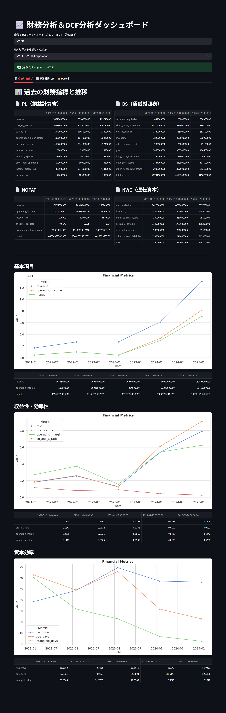
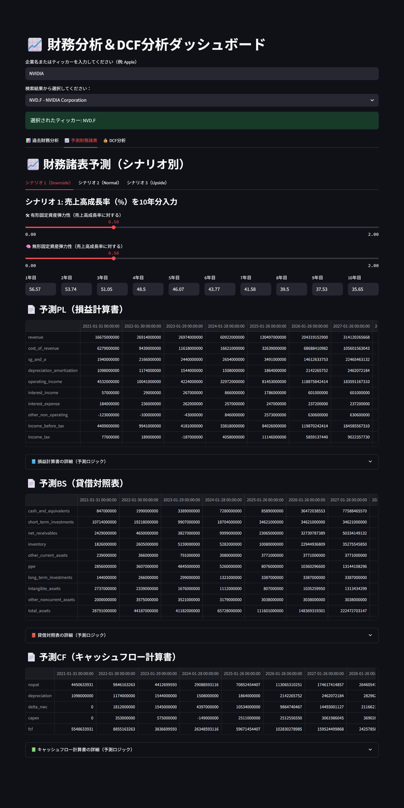
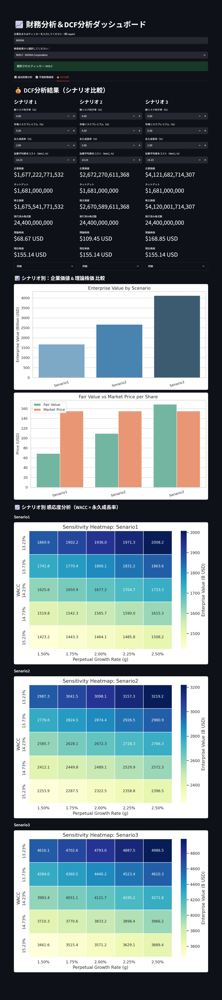

# DCF分析アプリ
[FMP API](https://site.financialmodelingprep.com/)から米国株の情報を取得し、DCF法により企業価値を評価するアプリです。






## 仮想環境での実行
1. **リポジトリをクローン**
```
git clone https://github.com/kazumasa-okamoto/dcf-app
cd dcf-app
```
2. **環境変数の設定**

`.streamlit/secret.toml`ファイルを作成し、以下の内容を設定してください。
```
FMP_API_KEY = "YOUR_FMP_API_KEY"
```
3. **依存関係のインストール**
```
uv venv
uv sync
```
4. **アプリの実行**
```
streamlit run main.py
```

